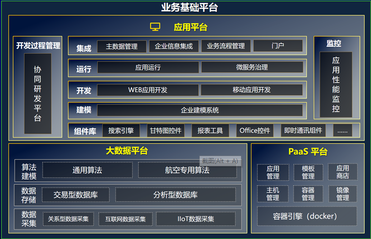
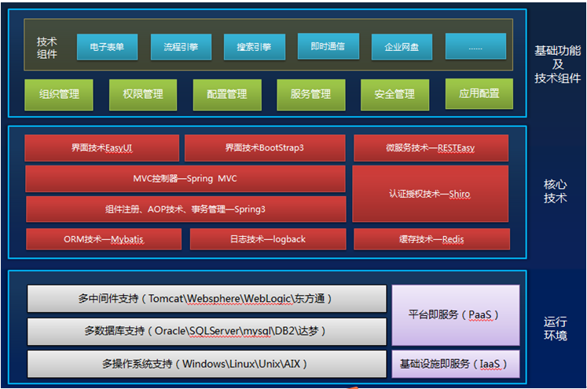
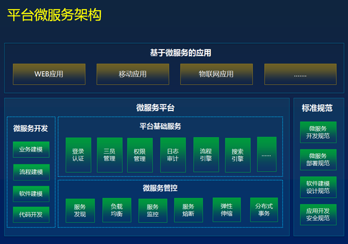
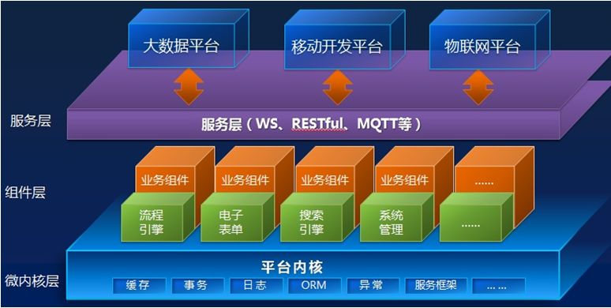

# 技术白皮书
<!-- TOC -->

- [技术白皮书](#%E6%8A%80%E6%9C%AF%E7%99%BD%E7%9A%AE%E4%B9%A6)
    - [概述](#%E6%A6%82%E8%BF%B0)
    - [平台架构](#%E5%B9%B3%E5%8F%B0%E6%9E%B6%E6%9E%84)
        - [平台应用架构](#%E5%B9%B3%E5%8F%B0%E5%BA%94%E7%94%A8%E6%9E%B6%E6%9E%84)
        - [平台技术架构](#%E5%B9%B3%E5%8F%B0%E6%8A%80%E6%9C%AF%E6%9E%B6%E6%9E%84)
        - [平台优势](#%E5%B9%B3%E5%8F%B0%E4%BC%98%E5%8A%BF)
- [平台关键技术特性](#%E5%B9%B3%E5%8F%B0%E5%85%B3%E9%94%AE%E6%8A%80%E6%9C%AF%E7%89%B9%E6%80%A7)
    - [高可用](#%E9%AB%98%E5%8F%AF%E7%94%A8)
    - [高性能](#%E9%AB%98%E6%80%A7%E8%83%BD)
    - [安全性](#%E5%AE%89%E5%85%A8%E6%80%A7)
    - [可扩展性](#%E5%8F%AF%E6%89%A9%E5%B1%95%E6%80%A7)
    - [IT国产化](#it%E5%9B%BD%E4%BA%A7%E5%8C%96)
    - [快速开发](#%E5%BF%AB%E9%80%9F%E5%BC%80%E5%8F%91)

<!-- /TOC -->
## 概述

金航业务基础平台V6是面向未来信息化发展趋势，支撑新技术发展要求而产生的新一代软件平台，本平台完全由金航数码自主研发而成。金航数码于2012年启动平台的规划和研发，经过多轮验证和研发的迭代，目前已经发展到R3版本，该版本在Windows、Linux、AIX、Oracle一体机等多种异构环境下进行了大量的兼容性和高并发测试，表现出了良好的性能。基于业务基础平台V6可以构建多个应用共享一个平台的部署架构，实现技术架构统一、基础数据共享、组件可插拔，极大提升了应用系统间的集成能力。目前已经基于业务基础平台V6构建了MES、协同办公、多项目管理、资金管理、合同管理等诸多自主软件，并在航空、航天、国航发、船舶、兵器等装备制造业得到广泛应用，目前使用的客户超过 100 家。在航空行业内，先后在集团总部、西飞、陕飞、洪都、沈阳所等多个用户的关键业务领域进行了应用和验证，实施的项目超过100个。

## 平台架构
###	平台应用架构

**业务基础平台V6** ：是面向企业复杂业务，符合企业中台战略，支持组件重用和积累，适应业务随需而变，符合统一IT架构和集成规范，满足应用系统开发、运行、集成、维护、以及管理需要的软件基础框架。在整个软件系统层次结构中，业务基础平台位于数据库和中间件之上，应用系统之下。

业务基础平台V6主要是由应用平台、大数据平台、PaaS平台构成。

**应用平台**是IT业务应用的综合开发运行环境，面向系统的构建与运行，包含。覆盖了应用系统需求分析、业务设计、代码开发、系统测试、过程管理、系统集成、性能监控的软件研发与运行全过程。

**大数据平台**是企业大数据的赋能平台，主要包含数据采集、数据存储和算法建模三个部分。满足企业对内、外数据的采集、清洗、转换、分析、挖掘。其中，航空专用算法模型库的建设将加速航空工业制造业的智能化与信息化进程。

**PaaS平台**是云计算的基础，包含应用管理、模板管理、应用商店、主机管理、容器管理、镜像管理、容器引擎。通过对物理资源的管理及云端应用的自动部署和管理，为企业开发、部署和实施云化业务应用而提供支撑。

###	平台技术架构

平台技术架构是由运行环境支撑层、核心技术层、基础功能和技术组件层组成，这些内容构成了应用系统运行的最基本内核。业务基础平台V6采用广泛应用的、质量可靠的Java EE开源领域成熟技术组件，经过设计团队的总结和提炼，有机进行组合，形成了经过高度优化的，成熟稳定的应用系统技术架构，并包含了应用系统开发所需的大部分技术组件，内容包含了电子表单、搜索引擎、流程引擎、即时通信、企业网盘、报表等常用功能。

技术架构层是在系统平台层（操作系统、数据库及应用服务器）和业务架构层之间建立的一层技术封装层和系统资源监控和管理层。技术架构层屏蔽不同具体技术实现的细节，减少直接使用系统资源带来的复杂性、异构性、不安全性及不稳定性；技术架构层监控和管理系统资源，保证系统资源的可用性及其合理使用；技术框架层提供最佳编程模式，加快在不同技术平台上开发和部署应用的速度，保证应用的健壮性。技术架构层所屏蔽技术实现细节包括界面风格、多数据库适配、事务处理、并发处理、缓存处理、安全管理等等。

平台运行环境支持多种操作系统（Solaris、Linux、Windows 等），可运行于符合 J2EE 规范的多种应用服务器（Tomcat、JBoss、IBM WebSphere、Oracle WebLogic等），数据库支持Oracle、Mysql、SQLServer、达梦等多种数据库。

平台核心技术层采用多个主流成熟的开源组件，其中展现层使用页面展示功能强大的jQueryEasyUI和Bootstrap3，控制层采用Spring MVC 模式构造，业务逻辑层为Spring，数据层使用MyBatis，服务层采用了轻量化的REST服务，为了提升组织用户、数据字典等基础数据的读性能，平台采用了REDIS作为缓存服务。合理的分层，简化了管理的复杂性，降低软件开发技术难度。

平台的界面技术提供了基于EasyUI和Bootstrap3的两种技术组件。如果客户端浏览器是IE8以上版本或者Chrome、Firefox浏览器，我们强烈推荐使用Bootstrap3 UI组件。

基于EasyUI技术主要用于传统的企业级应用系统，功能丰富，支持IE6+、Chrome、Firefox等主流的浏览器，尤其是对IE6、IE7的支持是目前WEB UI技术的最佳选择。基于Bootstrap3的UI组件，支持响应式布局，拥有丰富的UI组件，和HTML5无缝融合，是未来WEB发展的主流技术，新的UI组件既能满足后台管理系统的需求，也可以开发互联网化的网站界面，在性能和易用性上比easyui更好，支持IE8+、Chrome、Firefox等主流的浏览器。

在基础功能及技术组件层，平台提供了完善的基础功能包括：组织机构、集中授权、数据字典、三员管理、日志审计、登录认证、定时任务、服务管理、用户管理等共计50个功能模块。在基础功能之上是开箱即用的技术组件，包括：电子表单、流程引擎、搜索引擎、企业网盘、即时通讯、Office控件、甘特图控件等30+个，平台将应用软件的业务逻辑和开发技术分开，使得应用软件的开发者可以仅关注应用的业务逻辑，而不必关注其繁琐的技术实现，这使管理层与业务人员参与应用软件的开发成为可能。

平台在支持传统单体应用的基础上还支持分布式的微服务架构。在传统应用架构基础上增加了微服务管控层，应用通过微服务管控层将自身的业务能力以服务的方式公开，其他应用在获取授权的前提下消费该服务。业务基础平台提供的系统管理、流程管理、电子表单等平台组件通过微服务管控将平台的基础服务开放给基于业务基础平台的应用。

平台的微服务管控支持服务注册、服务发现、服务监控、服务授权、服务网关、负载均衡、服务熔断、弹性伸缩、分布式事务等功能。
### 平台优势

**业务基础平台V6基于微内核、组件化、服务化的架构设计思想构建**。
平台微内核架构的核心系统提供系统运行所需的最小功能集，其它功能通过组件化机制向核心系统添加额外的功能，保证了功能的独立和分离，极大地提升了系统的可扩展。平台通过WebService、RESTful、MQTT等服务/消息适配技术，可以跟第三方系统、以及大数据平台、移动开发平台、物联网平台快速集成，大大提升了平台的集成能力和新技术的适配能力。

- **面向业务应用的快速开发，适应业务随需而变**

平台提供了完善的基础功能、丰富的应用模板、可视化拖拽开发、开箱即用的技术组件、完善开发规范和技术支持服务，客户基于平台可以快速构建应用系统。

- **基于组件化思想，实现软件资产积累和复用**

通过组件化研发，可逐步积累和沉淀企业软件组件库，形成组件化模式下可灵活组装和配置的模块，能够按需进行灵活装配，快速构建企业应用。

- **多应用共享平台，实现基础资源统一管理**

基于多个应用共享一个平台的机制，一个企业只需部署一个平台，满足企业统一技术平台的需求，实现基础资源的统一管理，简化多个应用系统重复管理的繁琐。

- **适应移动需求，支持移动应用快速构建**

移动开发平台基于Ionic+Cordova前沿技术，支持快速开发移动APP，并且一次编码可满足IOS、Andriod等多种移动设备运行的要求。

- **具备强大的系统集成能力，满足多层次集成需求**

平台提供了多层次的集成体系规范和相关系统，支持应用系统间的界面集成、流程集成、服务集成、数据集成。

- **采用多种安全机制，符合安全保密要求**

平台内置了防SQL注入、XSS注入的等OWASP十大攻击技术手段，还提供了日志审计、三员管理等BMB17和BMB20规定的安全保密功能。

- **支撑集群分布式部署，满足高可用高性能要求**

基于组件化服务化的架构技术，支持应用系统横向扩展部署，满足高可用需求，也支持按照业务组件分布式部署，满足高性能需求。

- **支撑多种异构环境部署，提升系统的兼容性**

平台不仅支持多种主流操作系统（Windows、Linux、AIX等）、WEB中间件（Tomcat、Websphere等），数据库（Oracle、Mysql等）的部署，还支持IT国产环境的部署。

- **完全自主开发、安全自主可控**

平台代码完全自主开发，而且支持大部分国产化软硬件运行，包括国产化龙芯芯片、中标麒麟操作系统、东方通WEB中间件、达梦数据库等。

# 平台关键技术特性

## 高可用

平台部署架构设计主要是为了满足系统高性能和高可用性的非功能性需求，通过合理的部署架构来满足系统7*24小时提供不间断的服务，主要的实现手段是通过集群部署和负载均衡实现。

## 高性能

平台底层采用了缓存机制和多线程技术保证高性能。

缓存技术是提高软件并发性和性能的重要技术手段。平台提供了缓存服务接口可以实现热点数据的高速缓存，与数据库搭配能大幅提高应用的响应速度，极大缓解后端存储的压力。

平台把常用的基础数据均写入缓存，提升查询效率，这些数据包括：组织用户信息、权限信息、流程定义信息、数据字典等。

多线程技术是提高软件性能的重要技术手段。平台提供了多线程接口可以支持不同优先级线程的抢先方式以及相同优先级线程的时间片轮换，业务组件实现该接口即可以使用多线程，最终实现软件性能的提升

## 安全性

保证应用程序和数据的安全是平台必须实现的功能，除了要满足BMB17和BMB20所规定的和三员管理、登录、日志等安全手段外，还要能够对常见的Web攻击进行防范，以实现平台的最高安全性。然而安全性的实现过程中，并不是简单依靠防火墙、防病毒程序的功能，而是在软件开发过程中就要考虑到安全性的要求，将不安全的请求进行拦截和处理，平台提供了相关的开发规范和技术手段可以实现必要安全防护。

按照系统非功能需求中对安全的要求，平台从网络传输、系统安全、数据安全等多个维度进行安全设计。

## 可扩展性

平台的可扩展性从部署、组件、接口三个维度进行了设计。

- 部署的可扩展性

在实际应用中，一台服务器服务能力总是有瓶颈的，当出现性能瓶颈的时候可添加服务节点来提高系统的吞吐量。平台相对于业务规则来说都是无状态的，每台服务器之间都是对称的，这样可以很方便的在负载均衡设备F5、NGINX或LVS下动态的添加、删除节点，保障水平集群部署的弹性扩展。

- 组件的可扩展性

平台自身采用微内核、插件化的体系结构，易于积木式组装，易于扩展和升级，只要新研组件符合组件化规范，即可无缝地集成到平台中运行，具体参考“2.1平台组件化架构”部分。

- 接口的可扩展性

平台通过后端接口和前端扩展机制来满足业务系统的定制化需求，在后端接口上，除了使用Java传统的继承机制扩展外，平台还提供了前后拦截器的机制，业务代码通过实现平台的拦截器接口即可实现业务上的扩展；在WEB前端扩展机制上，平台采用了extend文件夹的形式。

## IT国产化

平台在国产化IT架构的发展要求下，逐步扩展完善IT国产化的相关布局，目前已经在系统及相关组件方面极大程度上满足了国产化服务器、数据库、中间件、客户端等多个领域的自主可控的要求。

- **硬件方面**

在主机方面：满足了对长城擎天的支持；

- **软件方面**

在数据库方面：满足了南大通用、达梦、浪潮KDB、神通的支持；
在中间件方面：满足了东方通、金蝶、中创的支持；
在操作系统方面：满足了中科方德、银河麒麟、中标麒麟的支持；
在浏览器方面：满足了Firefox的支持；
在控件类方面：满足了普加JS版甘特图、WPS的支持。

另外，平台已经在客户（中国电子） 实现了对“麒麟+达梦+东方通”的综合支持验证工作。

## 快速开发

基于业务基础平台的应用快速开发，使得“零技术”背景的业务人员通过采用零编码的方式，运用平台电子表单与代码生成器等组件，基于可视化的操作与灵活配置，打通业务流程从设计到代码生成的快速开发，实现业务需求快速变更与应用开发的快速迭代工作。

**快速开发平台特点**

  **1)** 基于WEB的可视化业务流程场景与表单设计，开发不受环境、地点的限制；
   

 **2)** 工作流和管理功能的无缝结合，基于流程驱动的协同管理，满足随需应变的软件落地；

 **3)** 平台开发的功能将伴随平台升级平滑过渡，开发功能可以快速迁移；

 **4)** 对开发人员要求降低，只需熟悉简单SQL和业务逻辑；对于“组件、继承、多态”等复杂IT知识的要求降低，使开发和维护成本大幅降低；

 **5)** 强大流程定义功能，对业务逻辑、业务流程梳理再造、流程设计、流程配置、流程触发和归档等提供快速低成本的实现；

 **6)** 提供通用、成熟的组件库，方便用户组织管理独有的公共组件，提高组件重用性；

 **7)** 提供丰富的表单设计功能，通过模板与拖拽操作，快速构建从流程到表单的应用；

 **8)** 优化后的一体化建模工具提供了代码自动生成功能，通过使用该功能，用户只需要选择业务数据表，即可创建出针对此数据表字段的新增、修改、删除、查询功能模块。
以上构成了平台总体的快速开发能力特性。

<Vssue title="Vssue Demo" />

